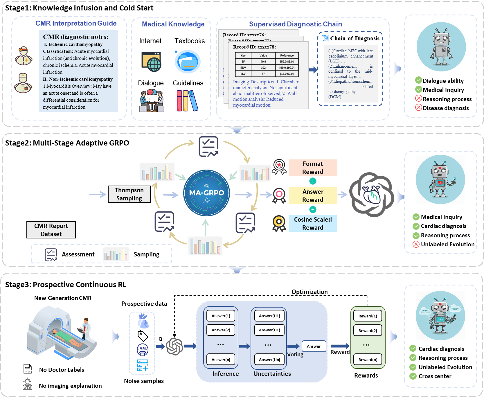

# CMR-R: Explicit Chain of Diagnosis for CMR Semantic Interpretation via Large Reasoning Model 🧠

**CMR-R** (Cardiac Magnetic Resonance - Reasoning) is a specialized Large Reasoning Model (LRM) designed to provide an **Explicit Chain of Diagnosis (CoD)** for cardiovascular diseases.

Unlike traditional "black-box" AI models, CMR-R not only outputs a diagnosis but also generates a transparent reasoning pathway derived from CMR semantic features and functional parameters. It achieves diagnostic accuracy surpassing experienced radiologists (>10 years of experience) and leading general LLMs (e.g., GPT-5, DeepSeek-V3.2).

---

## 🌟 Key Features

* **Explicit Chain of Diagnosis (CoD):** Simulates the reasoning process of clinical experts, providing step-by-step evidence from imaging features to pathological conclusions.
* **State-of-the-Art Performance:** Achieved **ACC: 0.858** and **AUC: 0.944** across 8 cardiac categories, outperforming radiologists and closed-source models.
* **Handle Long-Tail Diseases:** Significantly improved detection of rare diseases (e.g., Myocarditis, Amyloidosis) using **MA-GRPO** (Multi-stage Adaptive Group Relative Policy Optimization).
* **Prospective Continuous Learning:** Capable of evolving with unlabeled, noisy prospective data via **PCRL** (Prospective Continuous Reinforcement Learning).
# CMR-R: Explicit Chain of Diagnosis for CMR Semantic Interpretation via Large Reasoning Model 🧠

**CMR-R** (Cardiac Magnetic Resonance - Reasoning) is a specialized Large Reasoning Model (LRM) designed to provide an **Explicit Chain of Diagnosis (CoD)** for cardiovascular diseases.

Unlike traditional "black-box" AI models, CMR-R not only outputs a diagnosis but also generates a transparent reasoning pathway derived from CMR semantic features and functional parameters. It achieves diagnostic accuracy surpassing experienced radiologists (>10 years of experience) and leading general LLMs (e.g., GPT-5, DeepSeek-V3.2).

---

## 🌟 Key Features

* **Explicit Chain of Diagnosis (CoD):** Simulates the reasoning process of clinical experts, providing step-by-step evidence from imaging features to pathological conclusions.
* **State-of-the-Art Performance:** Achieved **ACC: 0.858** and **AUC: 0.944** across 8 cardiac categories, outperforming radiologists and closed-source models.
* **Handle Long-Tail Diseases:** Significantly improved detection of rare diseases (e.g., Myocarditis, Amyloidosis) using **MA-GRPO** (Multi-stage Adaptive Group Relative Policy Optimization).
* **Prospective Continuous Learning:** Capable of evolving with unlabeled, noisy prospective data via **PCRL** (Prospective Continuous Reinforcement Learning).
### 🚀 Training Framework

Figure illustrates the **three-stage adaptive-learning framework** designed to power CMR-R. This pipeline transforms a base LLM into a specialized Large Reasoning Model capable of generating explicit "Chain-of-Diagnosis" (CoD) for cardiac imaging.

* **Stage 1: Knowledge Infusion & Cold Start**
  We integrate expert-curated clinical guidelines and textbooks with real-world case data. This supervised fine-tuning (SFT) establishes the model's foundational medical knowledge and dialogue capabilities.
* **Stage 2: Multi-Stage Adaptive GRPO (MA-GRPO)**
  To address the long-tail distribution of medical data (e.g., rare diseases like cardiac amyloidosis), we employ a dynamic sampling reinforcement learning strategy. MA-GRPO adaptively adjusts training weights to enhance reasoning on complex and minority classes.
* **Stage 3: Prospective Continuous RL (PCRL)**
  This stage enables the model to evolve using unlabeled, prospective clinical data. By leveraging uncertainty estimation and consistency voting for pseudo-labeling, CMR-R continuously refines its decision boundaries without requiring expensive manual annotations.

  